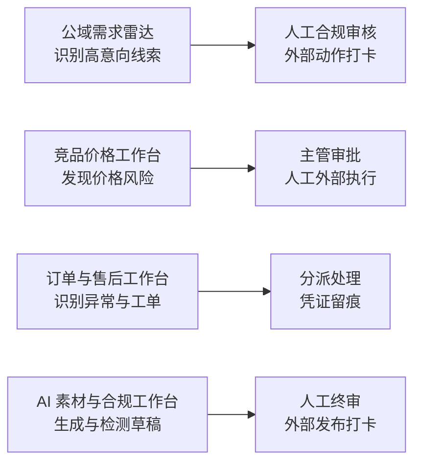

# 智营 RPA 数据驾驶舱

面向电商运营的本地可运行作品集 PoC。它把「获客、定价、履约、内容合规」拆成可演示、可审计的四类工作台，展示 RPA 与 AI 在企业运营中的正确落地边界。

> [!IMPORTANT]
> 本项目仅使用内置的模拟、脱敏数据；不连接真实平台，不存储账号密码、Cookie 或登录态，也不会执行自动评论、私信、发帖、改价、退款或发布动作。

## 能解决什么问题



| 模块 | 演示能力 | 关键边界 |
| --- | --- | --- |
| 经营数据驾驶舱 | 多渠道 KPI、异常、任务状态、统一数据导出 | 仅模拟经营数据，可作为 Power BI 数据集原型 |
| 公域需求雷达 | 本地 CSV 导入、意图分级、合规草稿、人工确认与外部打卡 | 不采集、不自动触达真实平台用户 |
| 竞品价格监控 | 竞品映射、价格异常、毛利熔断、策略建议、主管审批 | 系统不自动改价 |
| 订单与售后 | 异常订单识别、SLA、工单分派、补发凭证打卡 | 订单数据脱敏；高风险动作逐条人工处理 |
| AI 素材与合规 | 素材草稿、规则分级、知识库版本、模板复用、人工终审 | 不自动发布；健康内容仅为科普草稿 |

## 快速开始

环境要求：Node.js 20+

```bash
npm install
npm run dev
```

打开命令行显示的本地地址即可查看。默认入口会以长页呈现全部工作台，左侧导航可固定并跳转到相应模块。

## 验证命令

```bash
npm run test:run
npx playwright test
npm run build
npm audit
```

## 推荐演示路径（约 5 分钟）

1. 在「经营总览」说明全局筛选、角色切换、渠道适配器状态与异常驱动管理。
2. 进入「公域需求雷达」，展示脱敏导入、线索分级、合规审核、复制草稿与外部执行打卡的闭环。
3. 进入「竞品价格监控」，说明策略建议、毛利熔断、主管审批和人工外部执行的边界。
4. 进入「订单与售后处理」，展示异常识别、SLA、工单分派以及补发物流凭证留痕。
5. 进入「AI 素材与合规」，展示强拦截、弱提示、知识库版本、人工终审与发布打卡。

更完整的产品演示路径见 [演示脚本](docs/portfolio/demo-script.md)。

## 技术设计

- 前端：React 19、TypeScript、Vite、Recharts
- 测试：Vitest、Testing Library、Playwright
- 分层：`adapters`（数据接入） / `domain`（业务模型） / `services`（规则与状态机） / `pages`（工作台 UI）
- 数据策略：本地模拟数据与浏览器内 CSV 校验；对手机号、邮箱等直接可识别字段进行拦截
- 可扩展性：渠道适配器、规则版本、审计事件与降级状态均预留为可替换能力

各模块的设计与实施记录位于 [docs/superpowers](docs/superpowers)。

## 合规说明

- 平台实时数据接入应以官方 API 或具备明确授权依据的方式为前提；本 PoC 不提供规避平台限制的能力。
- 员工自有账号不构成自动化采集或触达的授权；系统不接收或保存平台凭据。
- 健康相关内容固定保留「仅为健康科普，不构成医疗建议」边界，并要求人工审核。
- 所有外部执行均通过「人工确认 → 外部系统操作 → 凭证打卡」留痕，而非由系统直接写入真实平台。
