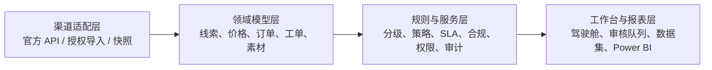

# 电商 RPA + AI 自动化运营体系方案

这是与具体行业解耦的作品集方案。它适用于国内电商、跨境电商与零售品牌，并以可配置的行业规则包适配差异化业务，而不是把某一个平台或品类写死在系统内。

## 目标

围绕“获客—定价—履约—内容合规”四条链路，降低重复运营成本，同时保留人工审核、审批、外部执行与审计留痕。

## 核心能力

| 链路 | PoC 能力 | 系统边界 |
| --- | --- | --- |
| 获客 | 脱敏导入、意图分级、合规草稿、外部执行打卡 | 不自动抓取、评论、私信或保存平台凭据 |
| 定价 | 竞品映射、异常过滤、策略建议、毛利熔断、主管审批 | 不自动改价；外部平台由人工执行 |
| 履约 | 异常订单、售后工单、SLA、负责人和凭证留痕 | 高风险订单、退款和补发逐条人工复核 |
| 内容 | 草稿生成、三级风险检测、知识库版本、模板复用、终审 | 不自动发布；健康类内容仅为科普草稿 |

## 通用架构

## 行业配置包

- 国内电商：渠道口径、促销节奏、平台社区规则与数据降级策略。
- 跨境电商：多站点、多币种、税费、时区、语言和本地化售后 SLA。
- 零售品牌：SKU、库存、会员、门店、促销和毛利红线。
- 医药健康：医学广告规则、敏感宣传词、免责声明、强拦截与人工终审。

## 实施建议

1. 先用 1—2 周统一数据口径、角色、风险边界和优先级。
2. 再用 3—6 周验证一条高频、可量化、风险可控的 MVP 链路。
3. 最后复制到更多渠道，并按企业已有的 Power BI、ERP、WMS 或官方 API 逐步集成。

## 合规原则

- 实时数据以官方 API、客户授权导入或明确标识的快照数据为前提。
- 系统不保存账号密码、Cookie 或登录态。
- AI 用于识别、建议和草稿；真实平台动作通过“人工确认—外部操作—凭证打卡”留痕。
- 所有演示数据均为模拟、脱敏数据。
